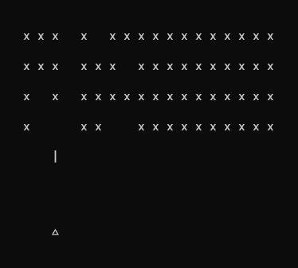

# Space Invaders in Rust

    

## Introduction
Space invader developed in rust to learn about the technology.

#

## So cool Guido! How I play it?
To play that game is simple, follow the steps bellow in installation section.

### Instalation
- Install rust in your machine: [get-started](https://www.rust-lang.org/learn/get-started)
- Clone this repo: `git clone https://github.com/GuidoEduardo/space-invaders.git && cd space-invaders`
- Execute `cargo run`
- Enjoy! 😎👌

#

That project is developed in this course: [Ultimate Rust Crash Course](https://www.udemy.com/course/ultimate-rust-crash-course/)